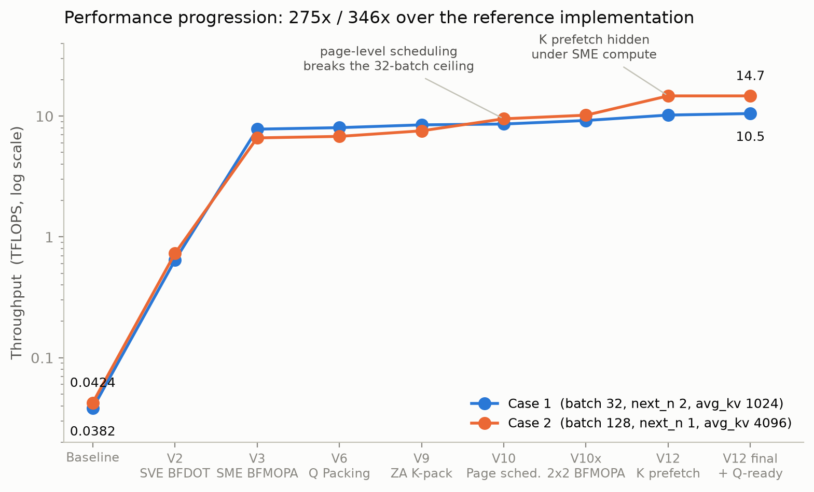
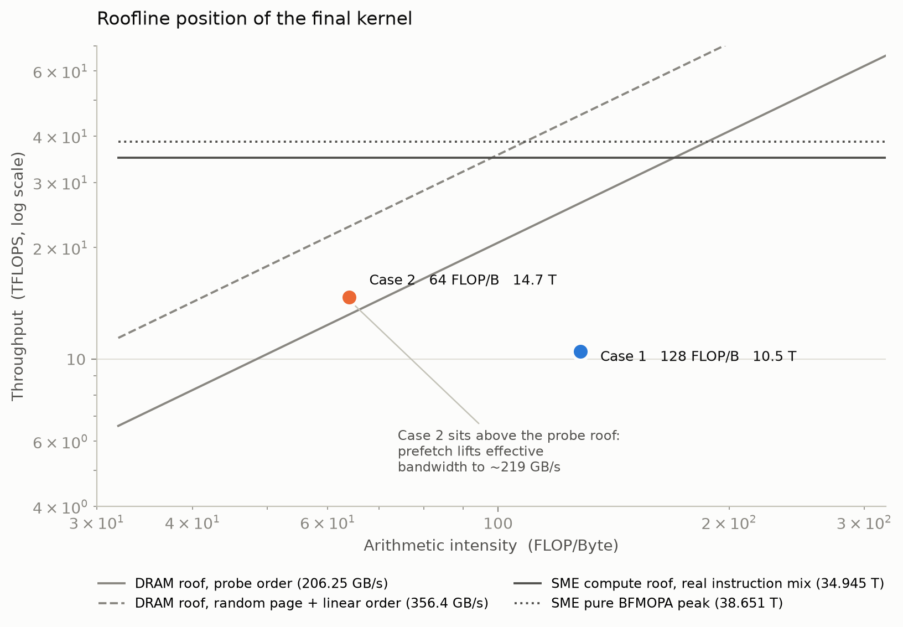
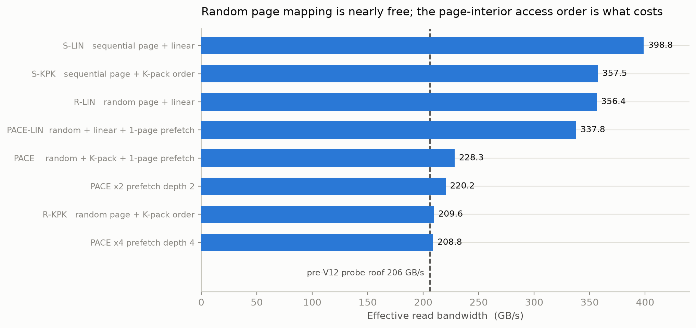
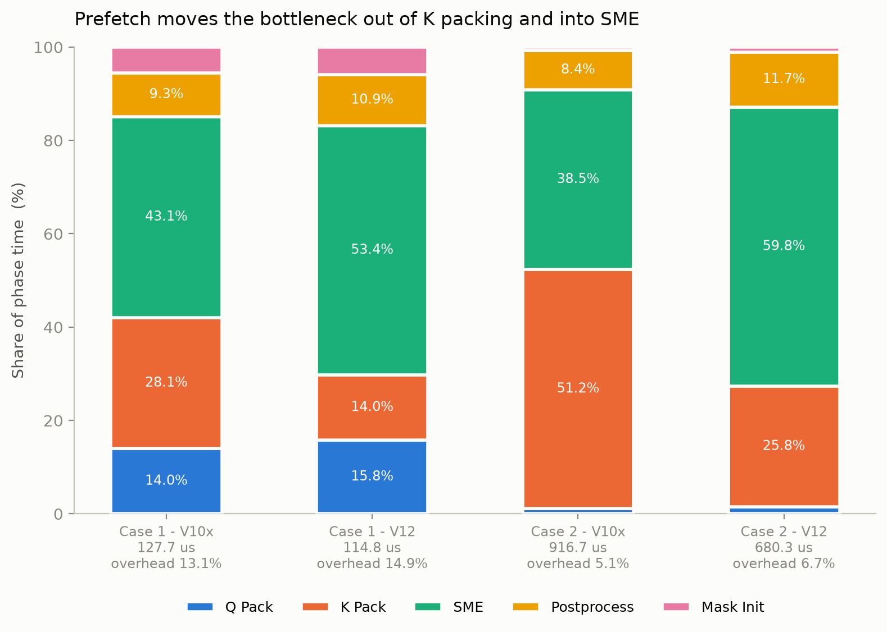

# PAC 2026 — indexer_mqa_logits


鲲鹏（AArch64）平台上 `indexer_bf16_paged_mqa_logits` 算子的 SME/SVE 优化实现。

赛题要求：在**只允许修改 `indexer_mqa_logits.h`** 的前提下，用 BF16 分页 KV Cache 完成
Query × KV 点积、ReLU、Head 加权归约并写出 Logits，按 **TFLOPS** 评分，精度门槛
`cos_diff < 5e-6`。


## 结果

| 测试用例 | Baseline | 最终版本 | 加速比 | 耗时 |
|---|---:|---:|---:|---:|
| Case 1 · batch 32 / next_n 2 / avg_kv 1024 | 0.0382 TFLOPS | **10.5 TFLOPS** | **274.7×** | ~101 μs |
| Case 2 · batch 128 / next_n 1 / avg_kv 4096 | 0.0424 TFLOPS | **14.7 TFLOPS** | **346.5×** | ~582 μs |

各版本精度检查全部通过，`cos_diff` 稳定满足 5e-6 门槛。



| 版本 | 核心优化 | Case 1 | Case 2 |
|---|---|---:|---:|
| Baseline | 参考实现 | 0.0382 T | 0.0424 T |
| V2 | SVE BF16 `BFDOT` 向量化 | 0.641 T | 0.730 T |
| V3 | SME `BFMOPA` Page 矩阵化 | 7.799 T | 6.600 T |
| V6 | SVE Gather 加速 Q Packing | 8.025 T | 6.794 T |
| V9 | SME ZA 转置加速 K Packing | 8.463 T | 7.554 T |
| V10 | Page 级负载均衡 + 38 核调度 | 8.6 T | 9.5 T |
| V10x | 融合 Streaming Mode、2×2 BFMOPA、联合后处理 | 9.2 T | 10.178 T |
| V12 | SME 计算期间预取下页 K | 10.2 T | 14.7 T |
| **V12 定稿** | + Q-ready 就绪标志 | **10.5 T** | **14.7 T** |

## 关键优化

1. **Page-by-Page 数据流。** 以 16 KiB KV Page 为计算单位，ReLU / 权重 / Head 归约全部融合，
   不再构造整段上下文的 FP32 副本。
2. **SME `BFMOPA` 矩阵化。** 512-bit SVL 下 `64×64` Page 精确拆成 16 个 `16×16` Tile；
   满 Page 使用 `2 Head Block × 2 Token Block` 的 2×2 分块，输入向量加载数减少 20%。
3. **ZA 转置做 K Packing。** 用 `ld1w {za0h.s[..]}` / `st1w {za0v.s[..]}` 把
   `16×16 uint32` Tile 在 ZA 内转置，离散 Gather 变成连续 ZA Slice 搬运（热页探针 4.79×）。
4. **Page 级调度。** 用 Page 前缀和把任务等分给 38 个线程，打破 `batch_size=32` 的并行度上限，
   并基本消除 Batch 长度长尾效应。
5. **SME 计算期间预取下页 K（本项目单点收益最大的改动）。** 把下页 K 的 `PRFM` 放进 BFMOPA
   的 K 循环尾部，走矩阵单元计算时**完全空闲**的 DRAM 窗口。下页 K Pack 由"DRAM 读约 3 μs"
   变为"L2 读约 0.3 μs"，Case 2 提升 41%。***<u>实现1+1=1的融合效果</u>***
6. **Q-ready per-row 就绪标志。** 用 `release/acquire` 发布每一行 Packed Q，替代 Q Pack 全局
   Barrier，让先打完的线程直接进入 Page 工作。


## Roofline 与瓶颈定位



实测得到的两个天花板（38 核、`taskset -c 0-37`、内存绑定单 NUMA 节点）：

- **计算 roof**：真实 2×2 BFMOPA 指令组合在 L1 驻留下 **34.945 TFLOPS**，为纯 BFMOPA 峰值
  38.651 TFLOPS 的 90.1%；
- **带宽**：随机 Page + K Packing 次序的有效读带宽探针测得 **206.25 GB/s**，
  而随机 Page + 线性次序可达 356 GB/s。



**随机 Page 映射几乎免费**（R-LIN 356 ≈ S-LIN 399），真正的代价是 Page 内的 256B 跨行访问序
（R-KPK 210）。预取深度 ×2/×4 反而略降，说明 PRFM 深度不是杠杆。



把 K 读隐藏到 SME 计算下之后，K Pack 占比近乎减半，SME 成为新的主导阶段（53%–60%）。
Case 2 最终卡在**内存控制器对 PRFM 请求流的投递能力**（~219 GB/s ≈ 14.7 TFLOPS），
软件层面可撬动的数据流杠杆已全部封顶。

## 目录结构

按赛题要求，**唯一改动的是 `indexer_mqa_logits.h`**，其余文件均为赛题原始代码。

真正的程序只有 `main.cpp` 及其调用树：

```text
main.cpp                     程序入口：测试用例生成、计时、精度校验
├── testcase.h               测试数据生成（Query / KV Cache / Block Table）
├── ref_mqa_logits.h         参考实现，正确性基准
├── indexer_mqa_logits.h  ★  唯一提交文件：手写 SME BFMOPA + SVE 内核
├── Tensor.h                 张量视图
├── utils.h                  BF16 转换、计时、断言
└── allocator.h              NUMA 绑定内存分配器
```

以下均为开发过程中的**副产品**，与最终提交无关，保留仅供参考：

```text
assets/                       本文档图表及生成脚本 make_charts.py
probes/                       微基准探针（SME 峰值、带宽矩阵、指令发射混合等）
others/ 					  副产品
    - kupl_mqa_logits.h             KUPL 调度层实验版本（实测中性偏负，未采纳）
    - sm90_fp8_mqa_logits.cuh       DeepGEMM 参考实现
    - roofline_data.txt             Roofline 与带宽探针原始数据
    - get_env.sh / get_env_log.txt  环境探测脚本与输出
    - AGENTS.md                     开发约定
    - test.sh                       赛题提供的运行脚本
```

## 构建与运行

```bash
g++ -O3 -march=armv9-a+sme+sve2 -fopenmp -lnuma main.cpp -o main

# 严格绑定单 NUMA 节点的 0-37 号核
OMP_NUM_THREADS=38 OMP_PROC_BIND=close taskset -c 0-37 ./main
```

可选 `-DEN_TIMING` 打开阶段计时（该构建走未融合路径，绝对性能低于正式构建，只能比阶段占比）。

## 环境

ARMv9 LX2，单 NUMA 节点 38 核、2.0 GHz，SVE/SME SVL 均为 512-bit，
L1D 32 KiB/Core、L2 768 KiB/Core、Cache Line 64 B，GCC 12.3.1。
完整实测配置见 [SVEconfig.md](SVEconfig.md)。

## 文档

- [PAC2026_indexer_mqa_logits_优化报告.md](PAC2026_indexer_mqa_logits_优化报告.md) —
  完整优化报告：逐版本数据、探针方法、未采纳方案与失败原因
- [SVEconfig.md](SVEconfig.md) — SVE/SME 软硬件配置实测
